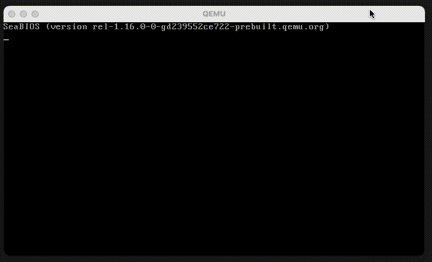

# systemd Minimal Linux

'systemd Minimal Linux' is a project that provides you with step-by-step instructions for building your own customized Linux system entirely from source.



The build time below is based on the build using Docker (CPUs: 8, Memory: 16GB, Swap: 1GB) on the Apple M1 Pro.

| Step             | Build Time |
|------------------|------------|
| Toolchain        | 00:29:53   |
| Root File System | 00:05:33   |
| Kernel           | 00:02:36   |
| Image            | 00:00:02   |

**The password for the root account is `root`. You can change the initial password for the root account by modifying `CONFIG_ROOT_PASSWORD` in `config.mk`.**

### Preparing Build Environment

Debian 10 or Ubuntu 22.04 is recommended.

``` bash
apt update
apt upgrade -y
apt install -y bc bzip2 cmake cpio curl file g++ gcc genisoimage git gperf make meson rsync texinfo wget xorriso xz-utils
```

### Step 1) Download All The Packages

``` bash
make download
```

### Step 2) Build Toolchain

``` bash
make toolchain
```

```
$ x86_64-linux-gnu-gcc --version
x86_64-linux-gnu-gcc (Systemd Minimal Linux for x86_64 2023.01) 12.2.0
Copyright (C) 2022 Free Software Foundation, Inc.
This is free software; see the source for copying conditions.  There is NO
warranty; not even for MERCHANTABILITY or FITNESS FOR A PARTICULAR PURPOSE.
```

### Step 3) Build Root File System

``` bash
make rootfs
```

### Step 4) Build Kernel

``` bash
make kernel
```

### Step 5) Generate image file

``` bash
make image
```

### How to run an image in QEMU


```bash
qemu-system-x86_64 -m 4G -smp 4 -machine type=q35 -kernel out/kernel/vmlinuz -drive file=out/image/rootfs.ext2,format=raw,index=0,media=disk,id=hd -append "root=/dev/sda"
```

### Thanks to

- [Buildroot](https://buildroot.org)
- [Linux From Scratch (LFS)](https://www.linuxfromscratch.org/)